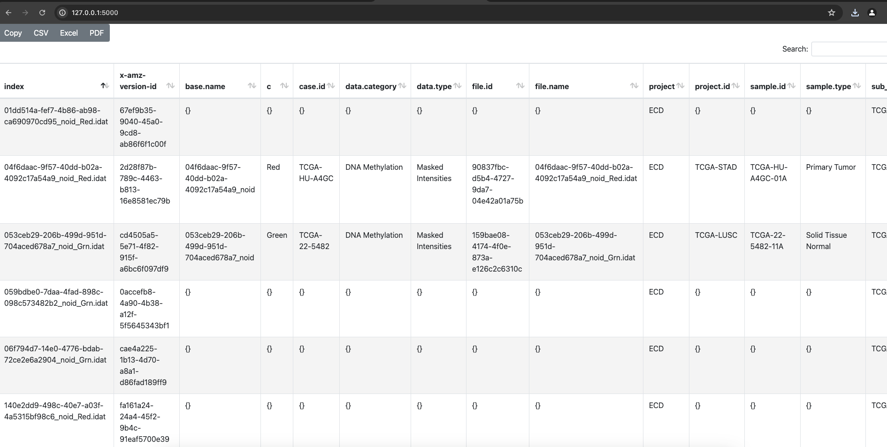

# DVC_system

## Introduction
Make use of `minio` object-storage to generate a database with customizable metadata template. Store research project data @GS. 

## Getting Started
Conda env, install with yml file in the repo.

### Usage
Current functions:
- `create_bucket`: create a bucket in the minio server. Provide credentials and bucket name. 

- `upload_file_with_metadata`: upload files to the bucket `bucket_name` with the provided `credentials`. The uploaded file must be accompanied by a metadata. 
 (to be updated: restrict metadata template for each bucket??)

- `extract_metadata_of_all_objects` extract metadata of all objects in the bucket, output in pandas dataframe format, feed to the FLASK app. 
### Expected output
An interactive table in which user can filter each column, search and download the selected metadata table. 

